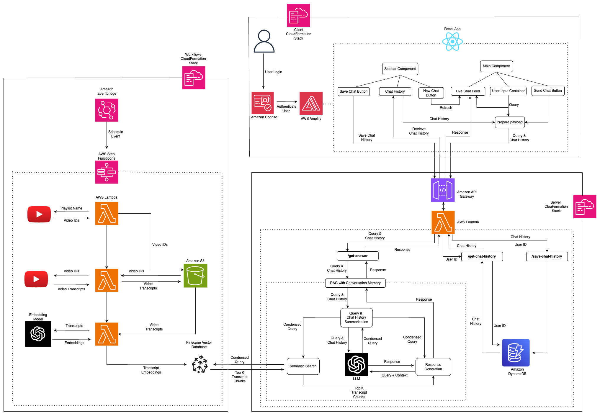

# ChatYTT

An application which allows users to leverage LLMs to retrieve natural language responses to questions about the contents of
Youtube Videos e.g. asking questions on what was discussed in long form content like podcasts. It does so, using
Retrieval Augmented Generation supplemented by Semantic Search over the embeddings of video transcripts. The application
consists of four main components:
- **chatytt**: The core component containing interfaces to the Youtube API for fetching transcripts, the Pinecone DB vector database for
storing embeddings of these transcripts (retrieved from OpenAIs embedding models), and langchain - the framework of choice for constructing
prompts to and retrieving responses from LLMs.
- **server**: A Flask API exposing endpoints to retrieve responses to queries, retrieving user chat history, and storing
user chat history.
- **client**: A React.js application providing a chat like user interface for asking questions, creating new chats to
separate lines of questioning and saving chats for future reference.
- **deploy**: The Cloudformation templates containing IaC used to deploy each component (with the AWS SAM CLI).

The architecture diagram below describe the end-end interactions of these components, as deployed on AWS:

Below is a demo of the web application:

https://github.com/suresha97/ChatYTT/assets/59473857/cb2ef369-6add-4501-a872-fcb9d0a65a58
